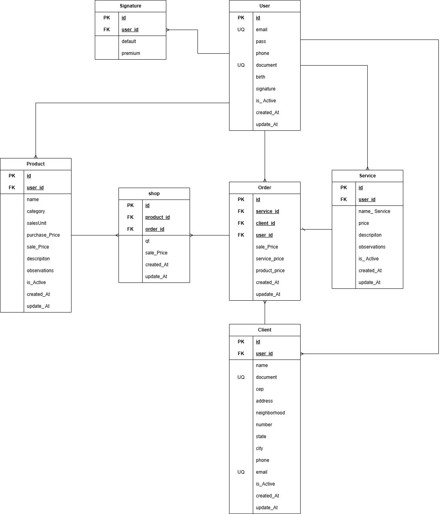

comandos para subir o **Banco de Dados** *prisma*

npx prisma generate
npx prisma migrate dev --name init
npx prisma db push  --force-reset
npx prisma db push 
npx prisma studio
npm run dev

remover o output do prisma client

# CRUD
//C - CREATE, INSERT, POST, SET, STORE


# ASYNC
// asincrono nome_da_função(recebendo, responder, próximo)

route.get('/:id', UserController.index); Significa que é dinamico e vira uma variavel

# Criptografia

npm install bcrypt express-session nodemailer uuid
npm install jsonwebtoken

# Documentação da Api do Projeto

## Contexto 

OS Control é um aplicativo desenvolvido com a finalidade de facilitar o usuário na organização dos seus clientes no ambito que envolve Ordens de Serviços.
Esse aplicativo acima sitado está sendo desenvolvido pelos integrantes da turma TI43, sendo Murilo Leandro, Murilo Andrade, leonardo e Marcos.

# comandos para subir o **Banco de Dados** *prisma*

npx prisma generate  
npx prisma migrate dev --name init  
npx prisma db push  --force-reset 
npx prisma studio
npm run dev


# Tabela de erros dos Enpoints 
status code:  
 

301 - O usuário precisa estar logado para fazer uma ação!   
400 - Campo Não Preenchido!    
422 - CPF / CNPJ/ e-mail/ CEP Inválido!  
404 - Não Encontrado!   
409 - Duplicidade!    
500 - Erro Interno!

# Exemplos de ações ao qual será retornado algum dos status code acima!!

 

```json
301 - O usuário precisa estar logado para fazer uma ação!

{
  "error": "O usuário precisa estar logado para fazer uma ação"
}
```

```json
400 - Campo Não Preenchido!

{
  "error": "Campo Não Preenchido!"
}
```

```json
422 - CPF / CNPJ/ e-mail/ CEP Inválido!  

{
  "error": "CPF / CNPJ/ e-mail/ CEP Inválido! "
}
```

```json
404 - Não Encontrado!  

{
  "error": "não encontrado"
}
```

```json
409 -  Duplicidade! 

{
  "error": "Duplicidade! "
}
```

```json
500 - Erro Interno!!  

{
  "error": "Erro Interno!"
}
```


## Modelagem de dados: tabelas, entidades ou estruturas jSON principais
 segue a abaixo link MER



# Client

## Criar Client

Para Criar um Client utiliza-se a Rota de POST /Clients

### Cabeçalho

É  necessário passar o cabeçalho:

```
content-type: application/json
Authorization: Bearer {{token}}

```

### Requisição
No body é necessário passar as informações para criar um Client.

```json
    {  
    "name": "Marcius",
    "document": "111.222.333.44",
    "cep": "12345-678",
    "phone": "16 12345-6789",
    "email": "marcius@gmail.com",
    "address": "Rua Epscopal",
    "number": 700,
    "neighborhood" : "Centro",
    "state": "São Paulo",
    "city": "São Carlos"

    } 
```

### Resposta - 201
Criado com Sucesso.
```json
    {  
    "name": "Marcius",
    "document": "111.222.333.44",
    "cep": "12345-678",
    "phone": "16 12345-6789",
    "email": "marcius@gmail.com",
    "address": "Rua Epscopal",
    "number": 700,
    "neighborhood" : "Centro",
    "createdAt": "2025-10-29T20:18:20.769Z",
    "updatedAt": "2025-10-29T20:18:20.769Z",
    "state": "São Paulo",
    "city": "São Carlos",
    "userId": 2
    } 
```

## Atualizar

Para Atualizar um Client utiliza-se a Rota de PUT /Clients

### Cabeçalho

É  necessário passar o cabeçalho:
```   
content-type: application/json
Authorization: Bearer {{token}}

```

### Requisição
No body é necesário passar as informações do Client para serem atualizadas 

```json
    {  
    "name": "Marcos",
    "document": "286.334.278-93",
    "cep": "12345-678",
    "phone": "16 12345-6789",
    "email": "mhcurila@gmail.com",
    "address": "Rua Epscopal",
    "number": 700,
    "neighborhood" : "Centro",
    "createdAt": "2025-10-29T20:18:20.769Z",
    "updatedAt": "2025-10-29T20:18:20.769Z",
    "state": "São Paulo",
    "city": "São Carlos",
    "userId": 2
    } 
```

### Resposta - 201
Atualizado com Sucesso.

```json
    {  
    "name": "Marcos",
    "document": "286.334.278-93",
    "cep": "13570-760",
    "phone": "16 12345-6717",
    "email": "mhcurila@gmail.com",
    "address": "Rua Epscopal",
    "number": 800,
    "neighborhood" : "Centro",
    "createdAt": "2025-10-29T20:18:21.769Z",
    "updatedAt": "2025-10-29T20:18:21.769Z",
    "state": "São Paulo",
    "city": "São Carlos",
    "userId": 2
    } 
```

## Deletar

Para deletar um client, utiliza-se a rota DELETE / Client.

### Cabeçalho

É  necessário passar o cabeçalho:

```   
content-type: application/json
Authorization: Bearer {{token}}

```

### Requisição
Na URL é necessário passar o ID, para o Client ser deletado.

```json

http://localhost:3000/client/1

```
### Resposta

```json
    {  
    "name": "Marcos",
    "document": "286.334.278-93",
    "cep": "13570-760",
    "phone": "16 12345-6717",
    "email": "mhcurila@gmail.com",
    "address": "Rua Epscopal",
    "number": 800,
    "neighborhood" : "Centro",
    "createdAt": "2025-10-29T20:18:21.769Z",
    "updatedAt": "2025-10-29T20:18:21.769Z",
    "state": "São Paulo",
    "city": "São Carlos",
    "userId": 2
    } 
```
Status code:  
200 - Deletado!


# Order    
## Criar Order Service
Para Criar uma Order Service, utiliza-se a Rota de POST / order.

### Cabeçalho

É  necessário passar o cabeçalho:

```   
content-type: application/json
Authorization: Bearer {{token}}

```
### Requisição
No body é necessário passar as informações, para o Cadastro da Order Service.


```json
    {

    "servicePrice" : 29,
    "productPrice" : 10,
    "userId" : 1,
    "serviceId" : 1,
    "clientId" : 1
  
    }
 ```
### Resposta - 201
Criado com Sucesso.


```json
    {

        "servicePrice" : 29,
        "productPrice" : 10,
        "userId" : 1,
        "isActive": true,
        "createdAt": "2025-10-29T20:18:30.769Z",
        "updatedAt": "2025-10-29T20:18:30.769Z",
        "userId": 1,
        "serviceId" : 1,
        "clientId" : 1
  
    }
 ```

## Atualizar

Para Atualizar uma Order Service, utiliza-se a Rota de PUT /order.

### Cabeçalho

É  necessário passar o cabeçalho:
```   
content-type: application/json
Authorization: Bearer {{token}}

```

### Requisição
No body é necesario passar as informações, para as Order Service serem atualizadas. 

```json
    {

        "servicePrice" : 29,
        "productPrice" : 10,
        "userId" : 1,
        "isActive": true,
        "createdAt": "2025-10-29T20:18:30.769Z",
        "updatedAt": "2025-10-29T20:18:30.769Z",
        "userId": 1,
        "serviceId" : 1,
        "clientId" : 1
  
    }
 ```
### Resposta - 201
Atualizado com Sucesso.

```json
    {

        "servicePrice" : 40,
        "productPrice" : 12,
        "userId" : 1,
        "isActive": true,
        "createdAt": "2025-10-29T20:18:32.769Z",
        "updatedAt": "2025-10-29T20:18:32.769Z",
        "userId": 1,
        "serviceId" : 1,
        "clientId" : 1
  
    }
 ```


## Deletar

Para deletar uma Order Service, utiliza-se a rota DELETE / order.

### Cabeçalho

É  necessário passar o cabeçalho:

```   
content-type: application/json
Authorization: Bearer {{token}}

```

### Requisição
Na URL é necessário passar o ID, para a Order ser deletada.

```json

http://localhost:3000/order/1

```
### Resposta

```json
    {

        "servicePrice" : 40,
        "productPrice" : 12,
        "userId" : 1,
        "isActive": true,
        "createdAt": "2025-10-29T20:18:33.769Z",
        "updatedAt": "2025-10-29T20:18:33.769Z",
        "userId": 1,
        "serviceId" : 1,
        "clientId" : 1
  
    }
 ```
Status Code:  
200- Deletado!

# Product
## Criar um produto

Para Criar uma Produto, utiliza-se a Rota de POST / product.

### Cabeçalho

É  necessário passar o cabeçalho:
```   
content-type: application/json
Authorization: Bearer {{token}}

```
### Requisição
No body é necessário passar as informações, para  criar um product.

```json
{
    "name" : "MSI B450",
    "category" : "Placa Mãe",
    "description" : "127v",
    "salesUnit" : "UN", 
    "purchasePrice" : 10, 
    "salePrice" : 20, 
    "observations" : "Azul",
    "isActive" : true
}
```
### Resposta - 201
Criado com Sucesso.

```json
{
  "id": 1,
  "name": "MSI B450",
  "category": "Placa Mãe",
  "description": "127v",
  "salesUnit": "UN",
  "purchasePrice": 10,
  "salePrice": 20,
  "observations": "Azul",
  "isActive": true,
  "createdAt": "2025-10-29T20:18:35.769Z",
  "updatedAt": "2025-10-29T20:18:35.769Z",
  "userId": 1
}
```


## Atualizar

Para Atualizar um Product, utiliza-se a Rota de PUT / product.

### Cabeçalho
É  necessário passar o cabeçalho:

```   
content-type: application/json
Authorization: Bearer {{token}}

```

### Requisição
No body é necesario passar as informações, para  o Product ser 
atualizado. 

### Resposta

```json
{
  "id": 1,
  "name": "MSI B450",
  "category": "Placa Mãe",
  "description": "127v",
  "salesUnit": "UN",
  "purchasePrice": 10,
  "salePrice": 20,
  "observations": "Azul",
  "isActive": true,
  "createdAt": "2025-10-29T20:18:35.769Z",
  "updatedAt": "2025-10-29T20:18:35.769Z",
  "userId": 1
}
```
### Resposta - 201
Atualizado com Sucesso.

```json
{
  "id": 1,
  "name": "Gforce B540",
  "category": "Placa Mãe",
  "description": "bivolt",
  "salesUnit": "UN",
  "purchasePrice": 12,
  "salePrice": 25,
  "observations": "Azul",
  "isActive": true,
  "createdAt": "2025-10-29T20:18:36.769Z",
  "updatedAt": "2025-10-29T20:18:36.769Z",
  "userId": 1
}
```


## Deletar

Para deletar um Product, utiliza-se a rota DELETE / product.

### Cabeçalho

É  necessário passar o cabeçalho:

```   
content-type: application/json
Authorization: Bearer {{token}}

```

### Requisição
Na URL é necessário passar o ID, para o Product ser deletado.

```json

http://localhost:3000/product/1.


```
### Resposta

```json
{
  "id": 1,
  "name": "Gforce B540",
  "category": "Placa Mãe",
  "description": "bivolt",
  "salesUnit": "UN",
  "purchasePrice": 12,
  "salePrice": 25,
  "observations": "Azul",
  "isActive": true,
  "createdAt": "2025-10-29T20:18:37.769Z",
  "updatedAt": "2025-10-29T20:18:37.769Z",
  "userId": 1
}
```
status code:  

200 - Deletado!   


# Service

## Criar um Service

Para Criar um Service, utiliza-se a Rota de POST / Service.

### Cabeçalho

É  necessário passar o cabeçalho:

```   
content-type: application/json
Authorization: Bearer {{token}}

```
### Requisição
No body é necessário passar as informações, para  criar um Service.

```json
    {
        "nameService" : "limpeza",
        "price" : 20, 
        "description" : "limpeza cpu", 
        "observations" : "ultima limpeza 2 anos", 
        "isActive" : true
    }
```


### Resposta - 201
Criado com Sucesso.

```json
 {
  "id": 2,
  "nameService": "limpeza",
  "price": 20,
  "description": "limnpeza cpu",
  "observations": "ultima limpeza 2 anos",
  "isActive": true,
  "createdAt": "2025-10-29T19:55:37.667Z",
  "updatedAt": "2025-10-29T19:55:37.667Z",
  "userId": 1
 }
```


## Atualizar

Para Atualizar um Service, utiliza-se a Rota de PUT / Service.

### Cabeçalho
É  necessário passar o cabeçalho:

```   
content-type: application/json
Authorization: Bearer {{token}}

```

### Requisição
No body é necessário passar as informações, para  o Service ser 
atualizado. 

```json
 {
  "id": 2,
  "nameService": "limpeza",
  "price": 20,
  "description": "limnpeza cpu",
  "observations": "ultima limpeza 2 anos",
  "isActive": true,
  "createdAt": "2025-10-29T19:55:37.667Z",
  "updatedAt": "2025-10-29T19:55:37.667Z",
  "userId": 1
 }
```
### Resposta - 201
Atualizado com Sucesso.

```json
 {
  "id": 2,
  "nameService": "limpeza",
  "price": 20,
  "description": "limnpeza cpu",
  "observations": "concluído",
  "isActive": true,
  "createdAt": "2025-10-29T19:55:40.667Z",
  "updatedAt": "2025-10-29T19:55:40.667Z",
  "userId": 1
 }
```          

## Deletar

Para deletar uma Order, utiliza-se a rota DELETE / service.

### Cabeçalho

É  necessário passar o cabeçalho:

```   
content-type: application/json
Authorization: Bearer {{token}}

```

### Requisição
Na URL é necessário passar o ID, para o Service ser deletado.

```json

http://localhost:3000/service/1.


```
### Resposta

```json
 {
  "id": 2,
  "nameService": "limpeza",
  "price": 20,
  "description": "limnpeza cpu",
  "observations": "concluído",
  "isActive": true,
  "createdAt": "2025-10-29T19:55:40.667Z",
  "updatedAt": "2025-10-29T19:55:40.667Z",
  "userId": 1
 }
```          
status code:  

200 - Deletado!   

# Signature

## Criar uma Signature

Para Criar uma Signature, utiliza-se a Rota de POST / Signature.

### Cabeçalho

É  necessário passar o cabeçalho:

```   
content-type: application/json
Authorization: Bearer {{token}}

```
### Requisição
No body é necessário passar as informações, para  criar uma Signature Free.

```json
    {
        
    "type" : "Free",
    "isActive": true

    }
```


### Resposta - 201
Criado com Sucesso.

```json
 {
  "id": 1,
  "type": "Free",
  "isActive": true,
  "createdAt": "2025-10-30T20:16:31.827Z",
  "updatedAt": "2025-10-30T20:16:31.827Z",
  "userId": 1
}
 
```

### Requisição
No body é necessário passar as informações, para  criar uma Signature Premium.

```json
    {
        
    "type" : "Premium",
    "isActive": true

    }
```


### Resposta - 201
Criado com Sucesso.

```json
 {
  "id": 1,
  "type": "Premium",
  "isActive": true,
  "createdAt": "2025-10-30T20:16:35.827Z",
  "updatedAt": "2025-10-30T20:16:35.827Z",
  "userId": 1
}
 
```  


## Atualizar

Para Atualizar uma Signature, utiliza-se a Rota de PUT / Signature.

### Cabeçalho
É  necessário passar o cabeçalho:

```   
content-type: application/json
Authorization: Bearer {{token}}

```

### Requisição
No body é necessário passar as informações, para  a Signature ser 
atualizada. 

```json
 {
  "id": 1,
  "type": "free",
  "isActive": true,
  "createdAt": "2025-10-30T20:16:35.827Z",
  "updatedAt": "2025-10-30T20:16:35.827Z",
  "userId": 1
}
 
```
### Resposta - 201
Atualizado com Sucesso.

```json
 {
  "id": 1,
  "type": "Premium",
  "isActive": true,
  "createdAt": "2025-10-30T20:16:40.827Z",
  "updatedAt": "2025-10-30T20:16:40.827Z",
  "userId": 1
}
 
```

## Deletar

Para deletar uma Signature, utiliza-se a rota DELETE / Signature.

### Cabeçalho

É  necessário passar o cabeçalho:

```   
content-type: application/json
Authorization: Bearer {{token}}

```

### Requisição
Na URL é necessário passar o ID, para a Signature ser deletada.

```json

http://localhost:3000/signature/1.


```
### Resposta


```json
 {
  "id": 1,
  "type": "Premium",
  "isActive": true,
  "createdAt": "2025-10-30T20:16:40.827Z",
  "updatedAt": "2025-10-30T20:16:40.827Z",
  "userId": 1
}
 
```
staus Code:
200 - Deletado!.